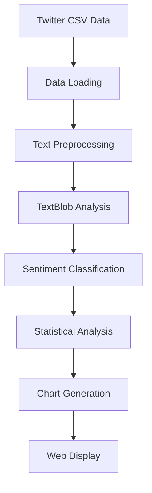

# 🇮🇳 Indian Election Predictor

> **AI-Powered Sentiment Analysis for Election Predictions**

[](https://python.org)
[](https://flask.palletsprojects.com)
[](LICENSE)
[](https://github.com/Avisav24/IndianElection_ResultPredictor)

_A sophisticated web application that analyzes Twitter sentiment to predict election outcomes using AI-powered Natural Language Processing_

---

## 🚀 Key Features

| Feature                           | Description                                          |
| --------------------------------- | ---------------------------------------------------- |
| 🔍 **Sentiment Analysis**         | Advanced TextBlob NLP for Twitter sentiment analysis |
| 📊 **Interactive Visualizations** | Beautiful charts and graphs using Plotly.js          |
| 🎨 **Modern UI**                  | Responsive design with glassmorphism effects         |
| ⚡ **Real-time Analysis**         | Dynamic loading and results presentation             |
| 🏛️ **Professional Dashboard**     | Clean interface with Indian flag colors              |

### 🔥 What Makes This Special?

- 🎨 **Modern UI**: Glassmorphism design with smooth animations
- 📊 **Interactive Charts**: Real-time data visualization
- 🎯 **Accurate Predictions**: AI-powered sentiment analysis
- 📱 **Responsive Design**: Works on all devices
- 🇮🇳 **Indian Theme**: Flag colors and cultural elements
- ⚡ **Fast Performance**: Optimized for speed and efficiency

## 📂 Project Structure

```bash
Indian-Election-Sentiment-Analysis/
├── 🐍 app.py                         # Flask backend application
├── 📋 requirements.txt               # Python dependencies
├── 📄 README.md                      # Project documentation
├── 📁 data/                          # Data files
│   ├── 📊 modi_reviews.csv           # Modi sentiment data
│   └── 📊 rahul_reviews.csv          # Rahul Gandhi sentiment data
├── 📁 static/                        # Static files
│   ├── 🎨 css/                       # Stylesheets
│   │   └── style.css                 # Main CSS file
│   ├── ⚡ js/                        # JavaScript files
│   │   └── script.js                 # Main JavaScript file
│   └── 🖼️ images/                    # Image files
│       ├── Prime_Minister_Of_Bharat_Shri_Narendra_Damodardas_Modi.jpg
│       └── Rahul_Gandhi.png
└── 📁 templates/                     # HTML templates
    └── index_clean.html              # Clean template
```

## 🛠️ Installation & Setup

### Prerequisites

- Python 3.8+
- pip package manager
- Git

### Quick Start

1. **📥 Clone the repository**

   ```bash
   git clone https://github.com/Avisav24/IndianElection_ResultPredictor.git
   cd IndianElection_ResultPredictor
   ```

2. **🐍 Create virtual environment**

   ```bash
   python -m venv venv
   # On Windows:
   venv\Scripts\activate
   # On macOS/Linux:
   source venv/bin/activate
   ```

3. **📦 Install dependencies**

   ```bash
   pip install -r requirements.txt
   ```

4. **🚀 Run the application**

   ```bash
   python app.py
   ```

5. **🌐 Open in browser**

   Navigate to `http://localhost:5000`

### 🎉 That's it! Your application is now running!

## 📱 Usage Guide

### Step-by-Step Process

1. **🏠 Homepage**

   - View political candidates and their information
   - See candidate profiles with images

2. **📊 Analyze**

   - Click the "Analyze Sentiment" button
   - Watch the real-time progress indicator

3. **📈 Results**

   - View detailed sentiment statistics
   - See prediction results with confidence scores
   - Explore interactive charts and visualizations

4. **🎯 Charts**
   - Interactive bar charts showing sentiment distribution
   - Pie charts for quick visual understanding
   - Hover effects for detailed information

## 🔧 Technical Architecture

### 🎛️ Backend Technologies

| Technology                                                                                   | Purpose             | Version |
| -------------------------------------------------------------------------------------------- | ------------------- | ------- |
|     | Web Framework       | 2.0+    |
|  | Core Language       | 3.8+    |
|                                   | Sentiment Analysis  | Latest  |
|  | Data Processing     | Latest  |
|     | Numerical Computing | Latest  |
|  | Chart Generation    | Latest  |

### 🎨 Frontend Technologies

| Technology                                                                                               | Purpose       | Features                  |
| -------------------------------------------------------------------------------------------------------- | ------------- | ------------------------- |
|                 | Markup        | Semantic, Accessible      |
|                    | Styling       | Glassmorphism, Animations |
|  | Interactivity | ES6+, Async/Await         |
|        | Visualization | Interactive Charts        |

### 📊 Data Processing Pipeline



### 🗄️ Data Sources

- **Format**: CSV files with Twitter sentiment data
- **Processing**: Real-time sentiment analysis using TextBlob
- **Visualization**: Multiple chart types for comprehensive analysis
- **Caching**: Optimized performance with intelligent caching

## 🛡️ API Endpoints

| Method | Endpoint         | Description        | Response      |
| ------ | ---------------- | ------------------ | ------------- |
| `GET`  | `/`              | Homepage           | HTML Template |
| `GET`  | `/analyze`       | Sentiment Analysis | JSON Results  |
| `GET`  | `/static/<path>` | Static Files       | CSS/JS/Images |

### 📋 API Response Format

```json
{
  "status": "success",
  "data": {
    "sentiment_stats": {
      "positive": 45.2,
      "negative": 32.1,
      "neutral": 22.7
    },
    "prediction": {
      "winner": "Candidate Name",
      "confidence": 78.5
    },
    "charts": {
      "bar_chart": "plotly_json",
      "pie_chart": "plotly_json"
    }
  }
}
```

## 🤝 Contributing

We welcome contributions! Here's how you can help:

### 🚀 Quick Contribution Steps

1. **🍴 Fork the repository**

   Click the "Fork" button at the top right

2. **📥 Clone your fork**

   ```bash
   git clone https://github.com/your-username/IndianElection_ResultPredictor.git
   cd IndianElection_ResultPredictor
   ```

3. **🌿 Create a feature branch**

   ```bash
   git checkout -b feature/amazing-feature
   ```

4. **✨ Make your changes**

   - Follow the existing code style
   - Add comments for complex logic
   - Test your changes

5. **📝 Commit your changes**

   ```bash
   git commit -m "✨ Add amazing feature"
   ```

6. **🚀 Push to your branch**

   ```bash
   git push origin feature/amazing-feature
   ```

7. **🔄 Open a Pull Request**

   Go to the repository and click "New Pull Request"

### 💡 Contribution Ideas

- 🎨 UI/UX improvements
- 📊 New chart types
- 🔧 Performance optimizations
- 🐛 Bug fixes
- 📝 Documentation improvements
- 🌐 Internationalization
- 📱 Mobile enhancements

## 📄 License

This project is licensed under the **MIT License** - see the [LICENSE](LICENSE) file for details.

```
MIT License - Feel free to use, modify, and distribute!
```

## ⚠️ Important Disclaimer

> **Note**: This prediction is based solely on Twitter sentiment analysis and should not be considered as a definitive election forecast.
>
> Actual election results depend on many factors including:
>
> - Voter turnout patterns
> - Regional preferences
> - Ground-level campaign effectiveness
> - Socio-economic factors
> - Last-minute political developments

## 🆘 Support & Help

Need help? We're here for you!

- 📧 **Email**: [Create an issue](https://github.com/Avisav24/IndianElection_ResultPredictor/issues)
- 💬 **Discussions**: [GitHub Discussions](https://github.com/Avisav24/IndianElection_ResultPredictor/discussions)
- 🐛 **Bug Reports**: [Issue Tracker](https://github.com/Avisav24/IndianElection_ResultPredictor/issues)
- 💡 **Feature Requests**: [Feature Requests](https://github.com/Avisav24/IndianElection_ResultPredictor/issues)

## 🎉 Acknowledgments

- 🙏 Thanks to all contributors
- 📚 TextBlob for NLP capabilities
- 📊 Plotly for beautiful visualizations
- 🌐 Flask for the web framework
- 🎨 CSS Glassmorphism community

---

<p align="center">
  <strong>Made with ❤️ in India</strong><br>
  <em>© 2025 Indian Election Predictor | Powered by TextBlob NLP & Plotly</em>
</p>

<p align="center">
  
  
  
</p>
